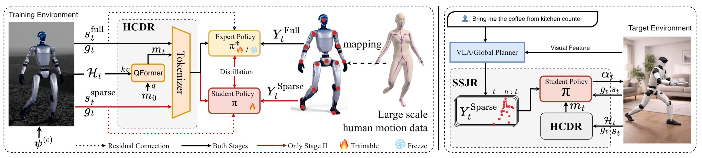

<div align="center">
  
  <h1>HoRD</h1>
  <p>Official codebase for humanoid robot motion imitation training.</p>

[](https://arxiv.org/abs/2602.04412)
[](https://huggingface.co/datasets/tony0517/HoRD)
[](https://huggingface.co/tony0517/HoRD)

  <br/>
  

</div>

## News

- **[2026/03/12]** Public dataset and checkpoints are now available on Hugging Face.

## Table of Contents

- [Quick Start](#quick-start)
  - [Create Environment](#create-environment)
  - [Install Dependencies](#install-dependencies)
  - [IsaacLab Setup](#isaaclab-setup)
  - [Genesis Setup Optional](#genesis-setup-optional)
- [Data Preparation](#data-preparation)
  - [Recommended Download from Hugging Face](#recommended-download-from-hugging-face)
  - [Optional Build from Raw AMASS SMPL](#optional-build-from-raw-amass-smpl)
  - [Pretrained Checkpoints](#pretrained-checkpoints)
- [Training](#training)
  - [Stage 1](#stage-1)
  - [Stage 2](#stage-2)
- [Evaluation](#evaluation)
  - [Play Motion](#play-motion)
  - [Evaluate Trained Model](#evaluate-trained-model)
- [Supported Simulators](#supported-simulators)
- [Supported Robots](#supported-robots)
- [Project Structure](#project-structure)
- [Acknowledgment](#acknowledgment)

## Quick Start

### Create Environment

```bash
conda create -n hord python=3.10
conda activate hord
```

### Install Dependencies

```bash
pip install --upgrade pip
pip install torch==2.7.0 torchvision==0.22.0 --index-url https://download.pytorch.org/whl/cu128
pip install -e .
pip install -e isaac_utils
pip install -e poselib
pip install flash-attn --no-build-isolation
pip install -r requirements.txt
pip install -U tensorboard
conda install -c conda-forge pydantic pydantic-core libstdcxx-ng
```

### IsaacLab Setup

Install IsaacLab directly (GLIBC >= 2.34):

```bash
pip install isaaclab[isaacsim,all]==2.1.0 --extra-index-url https://pypi.nvidia.com
```

Or install IsaacSim manually (example for RHEL 9):

```bash
wget https://download.isaacsim.omniverse.nvidia.com/isaac-sim-standalone%404.5.0-rc.36%2Brelease.19112.f59b3005.gl.linux-x86_64.release.zip
mkdir -p isaacsim
unzip isaac-sim-standalone@4.5.0-rc.36+release.19112.f59b3005.gl.linux-x86_64.release.zip -d ./isaacsim

# Replace this with your own path
export ISAACSIM_PATH="${HOME}/isaacsim"
export ISAACSIM_PYTHON_EXE="${ISAACSIM_PATH}/python.sh"
export XDG_DATA_HOME="${HOME}/.local/share"
export XDG_CACHE_HOME="${HOME}/.cache"
export XDG_CONFIG_HOME="${HOME}/.config"
```

### Genesis Setup Optional

Reference: https://genesis-world.readthedocs.io/en/latest/index.html

```bash
pip install genesis-world==0.2.1
```

Use `+simulator=genesis` in training or evaluation commands when running with Genesis.

## Data Preparation

### Recommended Download from Hugging Face

Processed training data is released in the dataset repository:
- Dataset repo: https://huggingface.co/datasets/tony0517/HoRD
- Dataset file: `train_g1_all.pt`

```bash
pip install -U "huggingface_hub[cli]"
mkdir -p data
huggingface-cli download --repo-type=dataset tony0517/HoRD train_g1_all.pt --local-dir data --local-dir-use-symlinks False
```

Use:
- `motion_file=data/train_g1_all.pt`

### Optional Build from Raw AMASS SMPL

Download resources first:
- AMASS dataset: https://amass.is.tue.mpg.de/download.php (SMPL and SMPLX formats)
- SMPL model files: https://smpl-x.is.tue.mpg.de/download.php

Then run:

```bash
# Convert AMASS data to Isaac format
python data/scripts/convert_amass_to_isaac.py data/amass/ --robot-type=g1 --force-retarget --humanoid-type=smplx

# Create motion FPS config
python data/scripts/create_motion_fps_yaml.py data/amass/ --output-path=data/yaml_files/ --humanoid-type=smplx --amass-fps-file=data/yaml_files/motion_fps_amass.yaml

# Process HML3D data (use the same FPS config file generated above)
python data/scripts/process_hml3d_data.py data/yaml_files/train_g1.yaml data/amass/ --humanoid-type=smplx --motion-fps-path=data/yaml_files/motion_fps_amass.yaml --robot-type=g1

# Package training data
python data/scripts/package_motion_lib.py data/yaml_files/train_g1.yaml data/amass/ data/train_g1_all.pt --humanoid-type=g1
```

### Pretrained Checkpoints

Pretrained checkpoints are released in the model repository:
- Checkpoint repo: https://huggingface.co/tony0517/HoRD

```bash
mkdir -p results
huggingface-cli download tony0517/HoRD your_checkpoint.ckpt --local-dir results --local-dir-use-symlinks False
```

Use:
- `+checkpoint=results/your_checkpoint.ckpt`

## Training

### Stage 1

```bash
python hord/train_agent.py +exp=full_body_tracker/transformer +robot=g1 +simulator=isaaclab motion_file=data/train_g1_all.pt +experiment_name=full_body_tracker_g1 ++headless=True
```

### Stage 2

```bash
python hord/train_agent.py +exp=masked_mimic/no_vae +robot=g1 +simulator=isaaclab motion_file=data/train_g1_all.pt +experiment_name=masked_mimic_g1 ++headless=True
```

## Evaluation

### Play Motion

```bash
python hord/eval_agent.py +base=[fabric,structure] +exp=full_body_tracker/transformer +robot=g1 +simulator=isaaclab +checkpoint=null +training_max_steps=1 +motion_file=data/train_g1_all.pt env.config.sync_motion=True ref_respawn_offset=0 ++headless=False ++num_envs=1 +experiment_name=play_motions
```

### Evaluate Trained Model

```bash
python hord/eval_agent.py +exp=full_body_tracker/transformer +robot=g1 +simulator=isaaclab +motion_file=data/train_g1_all.pt +experiment_name=full_body_tracker ++headless=False +checkpoint=results/your_checkpoint.ckpt ++num_envs=1
```

## Supported Simulators

- IsaacLab
- Genesis

## Supported Robots

- G1 (Unitree)
- H1 (Unitree)

## Project Structure

```text
hord/
├── hord/                  # Main code
│   ├── agents/            # RL algorithm implementations (PPO, AMP, etc.)
│   ├── envs/              # Environment implementations
│   ├── simulator/         # Simulator wrappers
│   └── config/            # Hydra configuration files
├── data/                  # Datasets and scripts
├── poselib/               # Pose processing library
├── isaac_utils/           # Isaac utilities library
└── results/               # Training outputs and downloaded checkpoints
```

## Acknowledgment

Thanks to the open-source robotics and simulation community for foundational tools and datasets.
